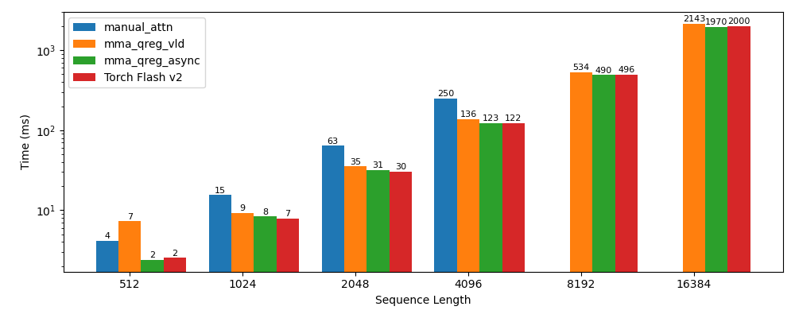

# flash-attention

This is a fork of [flash-attention-minimal](https://github.com/tspeterkim/flash-attention-minimal).

I am rewriting their kernels and add robustnest / performance.

- The variable names follow the notations from the original [paper](https://arxiv.org/abs/2205.14135).

## Benchmark


## Build Instructions

- Install CUDA Toolkit (I used 12.8).
- Install pytorch (I used 2.6.0).
- Clone [flash-attention](https://github.com/ishovkun/flash-attention).

```bash
git clone https://github.com/ishovkun/flash-attention.git
cd flash-attention
mkdir build && cd build
```

- Determine the Compute Capability of your GPU:

```bash
COMPUTE_CAP=$(nvidia-smi --query-gpu=compute_cap --format=csv | sed -n '2p' | sed 's/\.//g')
```

- Determine Pytorch path:

```bash
TORCH_PATH=$(python -c "import torch; print(torch.__path__[0])")
```

- Configure the build:
```bash
cmake .. -DTorch_DIR=${TORCH_PATH}/share/cmake/Torch \
        -DCMAKE_CUDA_ARCHITECTURES=${COMPUTE_CAP} \
        -DCMAKE_BUILD_TYPE=Release
```
- Compile the code:
```bash
make -j
```

## Run Instructions
- First, run the C++ code to make sure that the application built correctly. The runner runs the correctness tests.
```bash
./runner
```
- Next, run the Python benchmark:
```bash
python ../benchmarks/bench.py
```

## Results
manual_attn: 81.118 ms
naive: 3384.737 ms
scalar2d: 1748.492 ms
scalar2d_row_tile: 1575.13 ms
warp_wmma: 575.171 ms
block_wmma: 260.718 ms
block_wmma_row_block: 293.289 ms
block_wmma_async: 260.774 ms


## Benchmark
Benchmark 'block_wmma' took 254 [ms]
Benchmark 'wmma_row_block' took 152 [ms]
Benchmark 'mma' took 158 [ms]
Benchmark 'mma_swizzle' took 121 [ms]

## Benchmark May 14 11.19 AM
12 warps per block
Generate sample: Batch 4 Num Heads 96 Seq len 2048 Head embedding 128
Benchmark 'block_wmma' took 255 [ms]
Benchmark 'wmma_row_block' took 152 [ms]
Benchmark 'mma' took 180 [ms]
Benchmark 'mma_swizzle' took 107 [ms]
